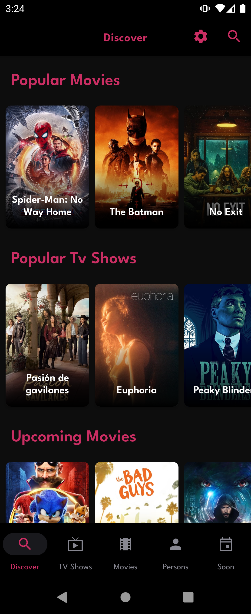
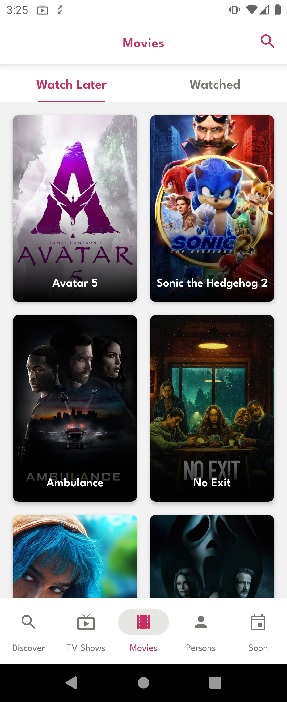
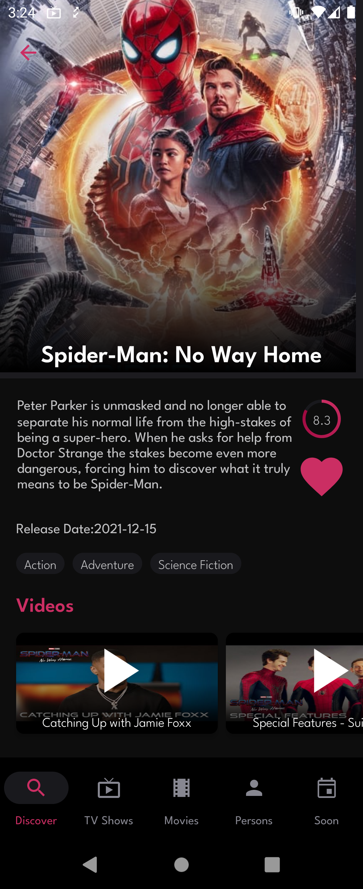
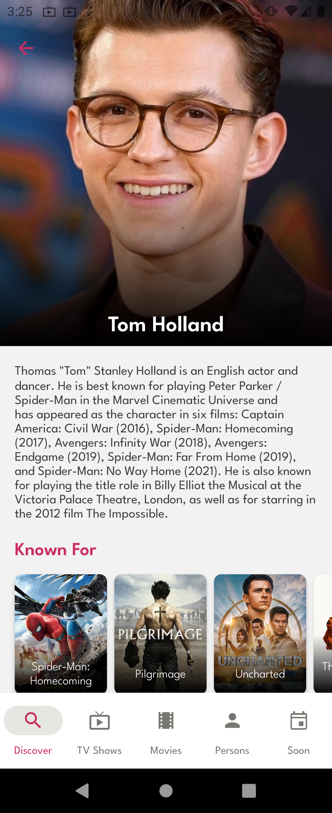
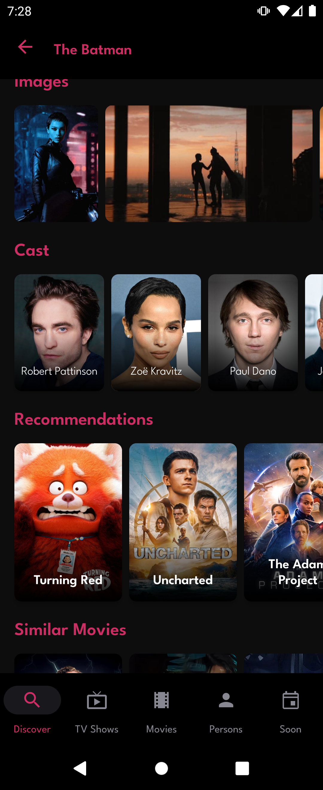
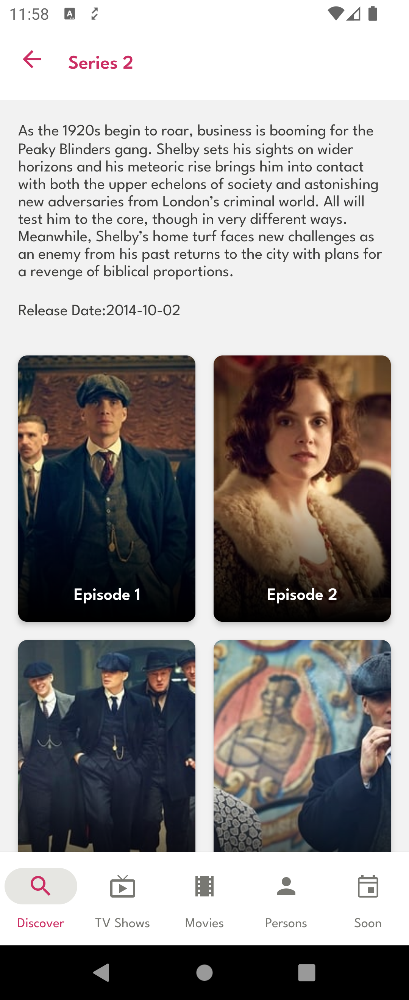
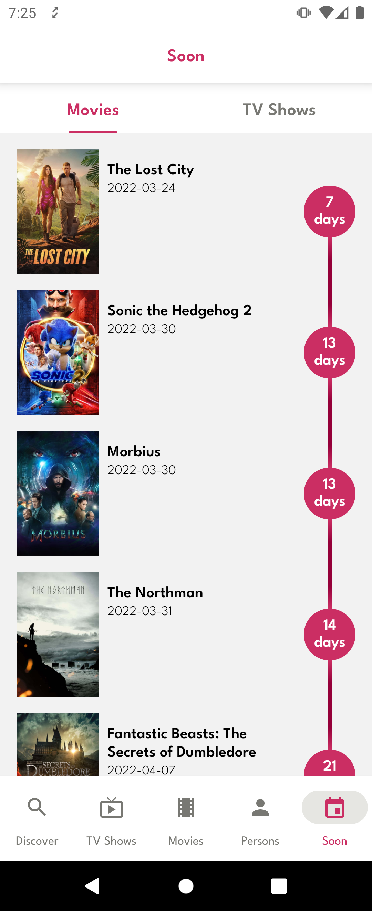
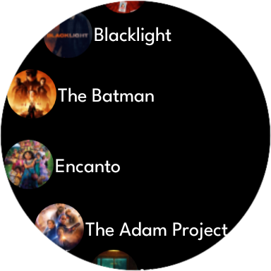
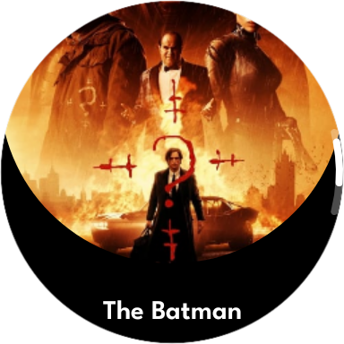

# Follow TV Movie

You can search movies/tv shows/persons.

You can create favorite list.

You can follow movie/tv release date.

| Discover | Movies | Movie Detail | Person Detail |
| --- | ----------- | --- | ----------- |
|   | |  |  |

* Tech-stack
    * [100% Kotlin](https://kotlinlang.org/) + [Coroutines](https://kotlinlang.org/docs/reference/coroutines-overview.html) - perform background operations
    * [Retrofit](https://square.github.io/retrofit/) - networking
    * [Jetpack](https://developer.android.com/jetpack)
        * [Navigation Graph](https://developer.android.com/topic/libraries/architecture/navigation/) - in-app navigation
        * [LiveData](https://developer.android.com/topic/libraries/architecture/livedata) - notify views about database change
        * [Lifecycle](https://developer.android.com/topic/libraries/architecture/lifecycle) - perform an action when lifecycle state changes
        * [ViewModel](https://developer.android.com/topic/libraries/architecture/viewmodel) - store and manage UI-related data in a lifecycle conscious way
        * [Room](https://developer.android.com/jetpack/androidx/releases/room) - store offline cache
        * [Work Manager](https://developer.android.com/topic/libraries/architecture/workmanager/basics) - notify when movie released
        * [Push Notification](https://developer.android.com/guide/topics/ui/notifiers/notifications) - notification
        * [Splash Screen API](https://developer.android.com/guide/topics/ui/splash-screen) - splash screen with animated icon
    * [Hilt](https://developer.android.com/training/dependency-injection/hilt-android) - dependency injection
    * [Flow](https://developer.android.com/kotlin/flow/stateflow-and-sharedflow) - view state
    * [Glide](https://github.com/bumptech/glide) - image loading library
    * [Lottie](http://airbnb.io/lottie) - animation library
    * [WearOs](https://developer.android.com/wear) - Wear App

* Modern Architecture
    * Clean Architecture
    * Single activity architecture ( with [Navigation component](https://developer.android.com/guide/navigation/navigation-getting-started))
    * MVVM
    * [Android Architecture components](https://developer.android.com/topic/libraries/architecture) ([ViewModel](https://developer.android.com/topic/libraries/architecture/viewmodel), [LiveData](https://developer.android.com/topic/libraries/architecture/livedata), [Navigation](https://developer.android.com/jetpack/androidx/releases/navigation))

* CI 
  * [Firebase App Distribution](https://firebase.google.com/docs/app-distribution)

* UI
    * [Material3](https://m3.material.io/) theme
    * [Dark Mode](https://developer.android.com/guide/topics/ui/look-and-feel/darktheme) - ui

| Movie Detail | Season Detail | Tv Show Detail | Soon |
| ------------ | ------------- | -------------- | ---- |
|  |  |   | |

| Popular Movies (Watch) | Movie Detail (Watch) |
| ------------ | ---- |
|   | |

